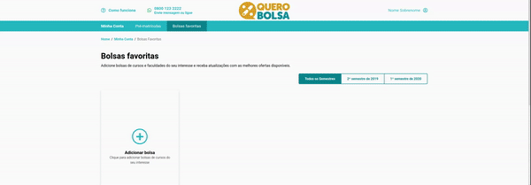

<div align="center">
  
</div>

<div align="center">
  <a href="https://nuxtjs.org/docs/get-started/installation/">
    
  </a>
  <a href="https://www.typescriptlang.org/">
    
  </a>
  <a href="https://sass-lang.com/">
    
  </a>
</div>
<div align="center">
  <a href="https://jestjs.io/pt-BR/">
    
  </a>
  <a href="https://www.docker.com/">
    
  </a>
</div>


<br />


# Favorite Scholarship

Front-end solution developed in [NuxtJS](https://nuxtjs.org/) with TypeScript (vue-class-components) and SASS.

## Challenge

This challenge was proposed for [Quero Educação](https://github.com/quero-edu) with the following requirements for the evaluation:

- The project has a single page (SPA), with a favorites list and a modal to search for courses.
- Should open the search modal by clicking on "add course"
- The search list has the following filters:
    - City
    - Course
    - Mode (Presencial/EaD)
    - Price
- The list of courses must be sorted by university
- Multiple courses can be selected and added to the favorites list
- The "add scholarship" button should be disabled when there are no courses selected
- The course can be removed from the favorites list by clicking the delete button
- "View Scholarship" button does not work
- Bags with `{ enabled: false }`, must appear with unavailable button
- The list of scholarships must respect the selected semester

[Saber Mais...](https://github.com/quero-edu/front-end-test-quero)

## Links

- Live Demo: [Clique Aqui](https://favoritescholarship.herokuapp.com/minha-conta/bolsas-favoritas)

## Development Principles

- Mobile First
- POO
- Unit Tests

## Author

- Website - [https://rodolfo-santos.com.br](https://rodolfo-santos.com.br)
- Linkedin - [@rodolfosantos29](https://www.linkedin.com/in/rodolfosantos29/)

## Project setup

```
npm install
```

### Compiles and hot-reloads for development

```
npm run serve
```

### Compiles and minifies for production

```
npm run build
```

### Run your unit tests

```
npm run test:unit
```

### Lints and fixes files

```
npm run lint
```

### Run production

```
npm run start
```
